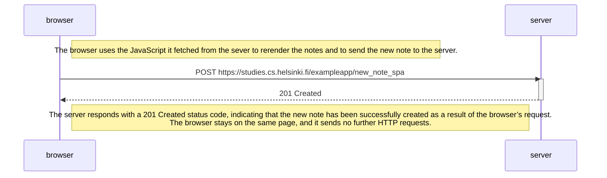

```mermaid
sequenceDiagram
    participant browser
    participant server

    Note right of browser: The browser uses the JavaScript it fetched from the sever to rerender the notes and to send the new note to the server.

    browser->>server: POST https://studies.cs.helsinki.fi/exampleapp/new_note_spa
    activate server
    server-->>browser: 201 Created
    deactivate server

    Note left of server: The server responds with a 201 Created status code, indicating that the new note has been successfully created as a result of the browser’s request. <br> The browser stays on the same page, and it sends no further HTTP requests.

```